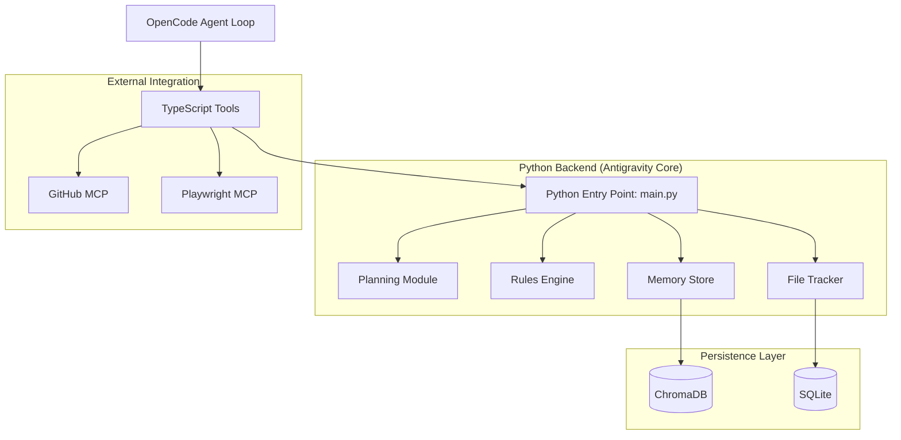

# Architecture Overview 🏗️

The **Antigravity Agentic Coding Plugin** is built on a modular architecture that bridges a flexible Node.js-based frontend (OpenCode tools) with a powerful Python-based backend.

## System Diagram

## Core Components

### 1. TypeScript Tools (Bridge Layer)
Located in `src/tools/core/`, these tools are compiled to JavaScript and invoked by OpenCode. They handle:
- Command-line argument parsing.
- Invoking the Python backend.
- Interacting with the filesystem and external APIs.

### 2. Planning Module (`python/planner.py`)
Responsible for task decomposition. It takes a high-level user request and generates a dependency-aware task graph. It uses LLMs to determine the necessary steps and their execution order.

### 3. Rules Engine (`python/rules_engine.py`)
The guardian of the system. It evaluates Markdown-based rules with YAML frontmatter.
- **AST Analysis**: For Python code, it uses the `ast` module to perform deep structural checks (e.g., forbidding `eval()`).
- **Condition Matching**: Supports simple string matching and regex conditions.

### 4. Memory Store (`python/memory.py`)
Provides long-term recall using **ChromaDB**.
- **Vector Search**: Encodes session findings and decisions as vectors.
- **Context Retrieval**: Allows the agent to "remember" why certain decisions were made in previous sessions.

### 5. File Tracker (`python/file_tracker.py`)
A robust SQLite-based logging system.
- **Pre-Write Capture**: Saves the original state of a file before any modification.
- **Session Isolation**: Groups changes by `SESSION_ID`.
- **Atomic Revert**: Orchestrates the restoration of files and deletion of new additions.

## Data Flow

1. **Request**: The user asks for a feature.
2. **Plan**: `/plan` decomposes the request.
3. **Execute**: The agent calls `write_file` or other tools.
4. **Track**: `write_file` calls the Python Backend to record the change in SQLite.
5. **Verify**: The Rules Engine validates the action against defined security and style rules.
6. **Commit/Undo**: The user either commits the session or uses the Undo tools to roll back.
